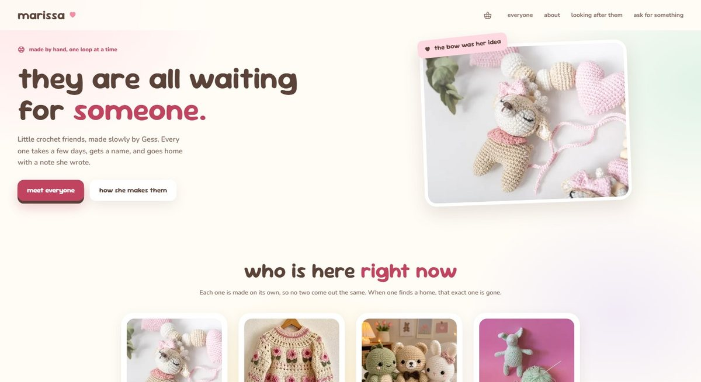
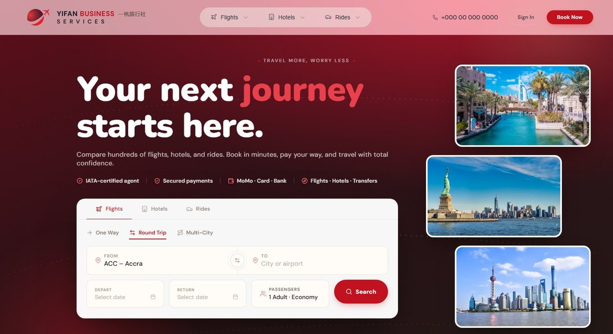
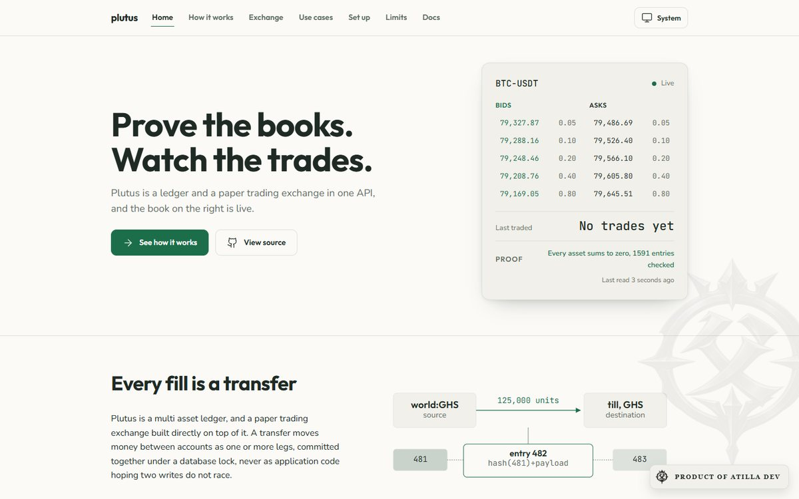
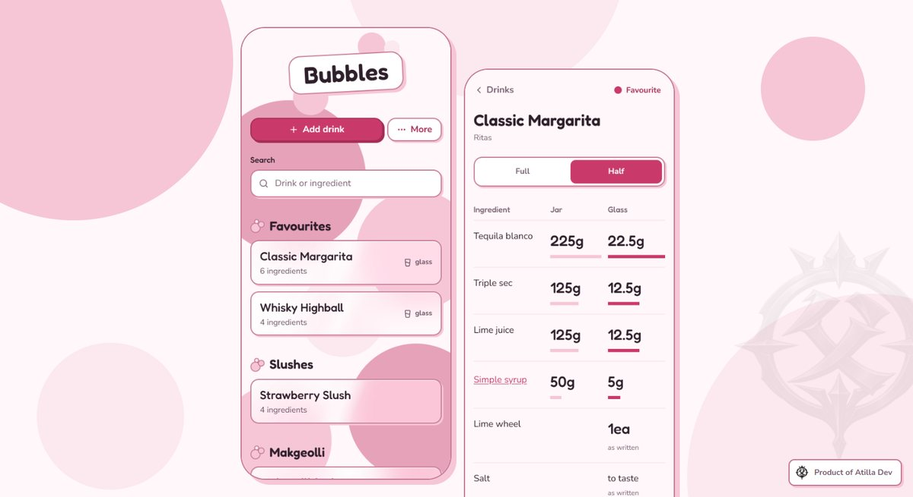

<picture>
  <source media="(prefers-color-scheme: dark)" srcset="assets/banner-dark.png">
  
</picture>

### Prince Newson Viala

Full stack software engineer in Accra, Ghana. I build products interface first, with real depth in the transactional systems, security and financial infrastructure underneath. Every build is attacked before it ships.

[Portfolio](https://atilladev.vercel.app) &nbsp;·&nbsp; [Resume](https://atilladev.vercel.app/resume) &nbsp;·&nbsp; [Email](mailto:owner.atilladev@gmail.com) &nbsp;·&nbsp; Open to relocation worldwide

 

## Selected work

### Marissa
A production shop for one of a kind handmade pieces. Each item sells exactly once, even when two buyers reach checkout at the same moment. Scored 39 of 40 on a design review.

[Case study](https://atilladev.vercel.app/work/marissa) &nbsp;·&nbsp; [Shop window](https://marissa-preview.vercel.app)

### Yifan Travel Platform
A travel booking platform built from zero for an operating travel business: flights, hotels, payments and a 15 section admin console, owned end to end as the sole technical hire.

[Case study](https://atilladev.vercel.app/work/travel-platform) &nbsp;·&nbsp; [Homepage preview](https://yifan-homepage.vercel.app)

### Plutus
A public ledger and paper trading exchange API. Every fill settles as an atomic ledger transfer, and anyone can verify the journal's integrity live. 261 tests run against real Postgres.

[Case study](https://atilladev.vercel.app/work/plutus) &nbsp;·&nbsp; [Source](https://github.com/atilladev-owner/Plutus) &nbsp;·&nbsp; [Live API](https://plutus-ten-eta.vercel.app)

### Bubbles
A pocket recipe book for a bartender's phone. It installs to the home screen, works with no signal, and halves a recipe in one tap.

[Case study](https://atilladev.vercel.app/work/bubbles) &nbsp;·&nbsp; [Open the app](https://bubbles-atilla-dev.vercel.app)

 

## How I build

**Build it.** Products owned end to end: interface, architecture, database and deployment. 
**Break it.** Concurrency, authorization boundaries, duplicate payments and recovery paths get attacked before release. 
**Prove it.** Tests run against a real database, and the result is checked against what the system has to do.

## Stack

**Frontend** &nbsp; React, Next.js, TypeScript, Tailwind CSS, responsive and accessible UI, PWAs, motion 
**Backend and systems** &nbsp; Node.js, Express, Python, PostgreSQL, Supabase, Redis 
**Infrastructure** &nbsp; Git, CI/CD, Vercel, Railway, Linux 
**AI engineering** &nbsp; Claude Code, LLM APIs, multi agent orchestration

 

Client code stays private by design, so most of the work above lives in private repositories. The live links and case studies carry the proof.
